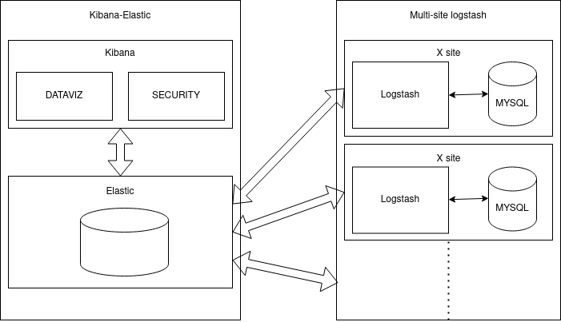

# Big Data MSPR

Ce projet permet le déploiement auto de l'infrastructure ETL utilisant la suite [Elastic](https://www.elastic.co/fr/).

Voici le schéma représentatif de l'infrastructure souhaitée. 

## Déploiement

### Etape préliminaire 

* Avoir [terraform](https://terraform.io) intallé sur votre machine
* Il est nécessaire de compléter le fichier `.env` en prenant exemple sur le fichier `.env.example`

### Déploiement 1er partie : création infrastructure matérielle

* Se rendre dans le dossier `./terraform`
* Intialiser la première partie du projet : `terraform init` 
* Déployer cette première partie : `terraform apply -auto-approve`

### Déploiement 2e partie : création des services Elastic et Kibana

* Puis se rendre dans le dossier `./terraform/data_mart_dwh/`
* Initialiser cette seconde partie du projet : `terraform init`
* Déployer cette partie : `terraform apply -auto-approve` 

### Déploiement 3e partie : ETL

* Aller dans le dossier `./terraform/etl/`
* Initialiser le dossier terraform `terraform init`
* Déployer : `terraform apply -auto-approve`

## Explications

Le projet se découpe donc en deux parties :

* La première permet de créer le serveur accueillant les services
* La seconde permet de déployer les services avec Docker

Le serveur kibana est ensuite accessible à l'adresse suivante : `http://etl.fredericpinaud.ovh`

